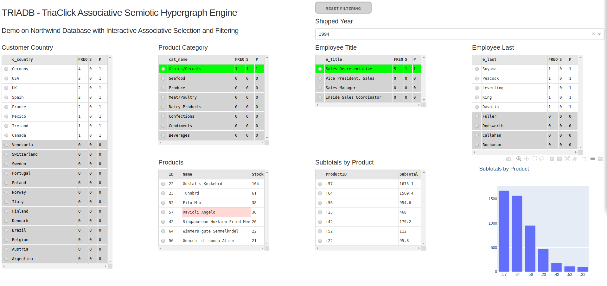

======
TRIADB
======

---------------------------------------------------------------------
Self-Service Data Management & Visual Interactive Analytics Framework
---------------------------------------------------------------------

**18th of October 2019**

Welcome to a fully functional and working open source release of TRIADB. You can use TRIADB to manage your disparate data sources, create custom data models with an integrated, whole view of your business and get a business insight by building easily dashboard web applications that work with the associative selection/filtering of Triaclick engine.

Getting Started
---------------
Watch a `screen capture demo <https://www.youtube.com/watch?v=QSk1ldfb7ow>`_ and see for yourself how powerful, flexible but not complicate is TRIADB for power BI users and developers.

        Northwind dashboard screen capture from the demo of TRIADB

TRIADB Tutorial
---------------
If you decide to go deeper, read the `tutorial guide <https://github.com/healiseu/triadb/blob/master/TUTORIAL.rst>`_ to get into the basics of programming with TRIADB.

Try TRIADB
----------
Analytic instructions on how to install TRIADB are written on the `installation guide <https://github.com/healiseu/triadb/blob/master/INSTALLATION.rst>`_.

Wish you a happy path testing and a pleasant experience

| *Athanassios I. Hatzis, PhD*
| *Founder of HEALIS.EU*

